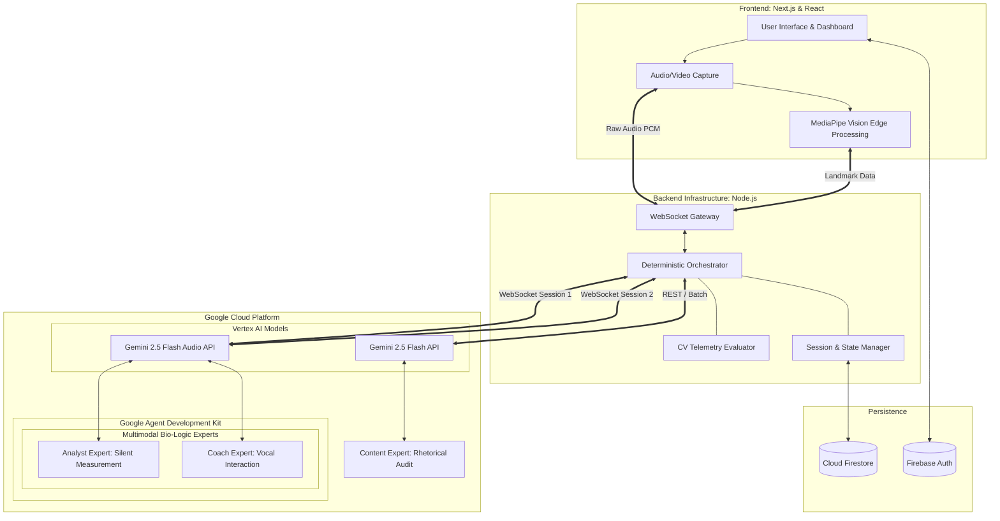

<div align="center">
  

  <h2>Aura Presentation Mentor</h2>
  
  <p><strong>A real-time, multimodal Live Agent that immerses professionals and students in high-stakes presentation environments.</strong></p>

  <p>
    
    
    
    
  </p>
  
  <p>
    
    
    
    
    
    
  </p>
</div>

<br/>

Aura Presentation Mentor represents a paradigm shift in presentation practice, functioning as a real-time, multimodal Live Agent that immerses professionals and students in high-stakes environments such as critical pitches, interviews, and keynotes. Rather than offering static, post-hoc analysis, Aura materializes as an active, empathic, and highly dynamic audience. It listens, observes, interjects, and adapts its persona continuously to simulate the pressure and unpredictability of authentic presentation scenarios.

## Why Did We Build This?

Public speaking is a critical skill, yet most professionals and students practice in a vacuum, talking to a mirror or recording endless monologues. Existing tools often provide static analysis after the fact, which fails to simulate the pressure and unpredictability of a real audience. We built the Aura Presentation Mentor to engineer a highly responsive, interactive practice environment devoid of latency-induced friction. 

The platform bridges real-time audio and video feeds directly into the Google Gemini Live API via scalable WebSockets. This continuous ingestion is orchestrated by a conceptual Mixture of Experts (MoE) pipeline, wherein distinct, concurrent sub-agents deconstruct non-overlapping analytical rubrics, spanning vocal delivery, rhetorical content, and physical body language. By projecting zero-shot behavioral telemetry natively into the presentation interface, the system achieves instant feedback without the cognitive burden of transcription delays.

## System Architecture

The technical foundation of Aura relies on an optimized, full-duplex streaming pipeline that connects the browser, an intermediate routing backend, Google Cloud infrastructure, and a robust persistence layer.

### Architectural Diagram



*(Note: The raw source of this visual representation is also available in the repository as `architecture.mmd`)*

### Architectural Flow and Component Integration

1.  **Ingestion & Edge Processing (Client-Side):**
    The Next.js frontend captures raw microphone PCM audio, while the downstream logic manages webcam video capture. Heavy vision workloads relative to gesture and posture analysis are offset to the edge utilizing MediaPipe tracking. Processed dimensional landmark data, alongside normalized video frames (1 fps) and continuous audio buffers, are pushed into a persistent WebSocket tunnel. Client-side Voice Activity Detection (VAD) operates constantly to flag user interruptions for immediate upstream processing.

2.  **State & WebSocket Gateway (Backend):**
    A Node.js server sits as the critical bridge layer. It establishes a secure, authenticated connection against Firebase and Cloud Firestore to govern presentation session states. Fundamentally, it maps incoming client WebSockets into outbound gRPC/WebSocket connections toward Vertex AI, serving as a low-latency proxy. It parses generated agent response payloads and routes execution telemetry to Google Cloud Logging.

3.  **Multimodal Evaluator (ADK & Gemini System):**
    The backend structures its cognitive workload using the Google Agent Development Kit (ADK) to encapsulate and manage a highly separated "Mixture of Experts" framework:
    *   **Orchestrator (Deterministic TypeScript):** Acts as the central hub, coordinating data flows between the client, local vision evaluations, and the multiple parallel agent sessions.
    *   **Analyst Expert (Gemini 2.5 Flash Preview, Session 1):** Operates on a dedicated, silent WebSocket connection. It focuses exclusively on high-precision measurements such as pacing analysis, filler word counting, and technical transcription.
    *   **Coach Expert (Gemini 2.5 Flash Preview, Session 2):** Runs on a parallel, loud WebSocket connection. It manages the vocal persona, generating real-time interjections and energetic coaching based on directives from the orchestrator.
    *   **Content Expert (Gemini 2.5 Flash, REST):** Offloads deeper semantic structuring and asynchronous session evaluations to the standard REST API logic to circumvent streaming-tier rate boundaries.

4.  **Database & Authentication Layer:**
    Google Firebase orchestrates identity management protocols, while Cloud Firestore handles real-time persistence for project metadata, session timelines, and generated analytics scorecards.

## What Aura AI Mentor Offers

Aura leverages current state-of-the-art multimodal agent techniques to establish an unprecedented standard for presentation coaching.

*   **Streaming Multimodal Understanding:** Audio, visual frames, and localized biometric landmarks are analyzed simultaneously, providing instant insights on peripheral engagement without relying on bottlenecked text transcription.
*   **Volatile Interruption Handling (Barge-in):** Engineered with full-duplex concurrency, the application detects user interruptions instantly. Server-side cancellation flags halt the agent's playback gracefully, allowing it to cede the floor and maintain a natural conversational cadence.
*   **Multifaceted Pipeline Evaluation:** A sophisticated orchestration routine directs distinct sub-routines:
    *   *Delivery & Vocal Coaching:* Targets pacing, intonation, and frequency of filler language.
    *   *Physical Vision Tracking:* Utilizes MediaPipe to score eye-contact stability, penalize slouching, and quantify hand-gesture engagement ranges.
    *   *Rhetorical Auditing:* Validates logical progression and argument structure throughout the presentation sequence.
*   **Hysteresis-Filtered User Interface:** Natively synced UI indicators (such as posture correction alerts) employ temporal smoothing to eliminate erratic flickering, ensuring uninterrupted visual directives.
*   **Contextual Re-Takes:** Presenters can verbally command the agent to disregard previous errors and establish a new continuous operational timeline for a specific section, relying on deep session memory to contrast the comparative iterations.
*   **Gesture-Driven Calibration:** Initiates a personalized baseline phase to record distinct user traits prior to evaluation, accounting for variations in static rest postures and baseline vocal ranges.

## Technologies Used

The infrastructure is delineated into high-performance web architecture coupled with robust Google Cloud integrations.

### Client Infrastructure
*   **Next.js & React 19:** Orchestrates the primary application state and handles complex component rendering for the dashboard and active presentation modes.
*   **Tailwind CSS:** Specifies the design language and cohesive visual styling across the application interfaces.
*   **MediaPipe Vision Tasks:** Operates natively in the browser (`@mediapipe/pose`, `@mediapipe/face_mesh`) to map facial landmarks and pose estimation matrices, vastly reducing external bandwidth dependencies.
*   **WebRTC & Browser Audio APIs:** Empowers direct and optimized continuous multimedia tracking to feed the WebSocket pipeline continuously.

### Server & Engine Core
*   **Node.js & Express:** Constructs the gateway endpoints and manages routing logistics bridging the client to the cloud ecosystem.
*   **WebSockets (`ws`):** Guarantees the necessary millisecond-level bidirectional transit mechanisms between the browser architecture and AI endpoints.
*   **Google Cloud Vertex AI & Models:** The core generative architectures, selectively utilizing `gemini-2.5-flash-preview-native-audio-dialog` for synchronized live multi-modality, and `gemini-2.5-flash` for complex state summarization pipelines.
*   **Firebase SDK & Firebase Admin:** Connects authentication vectors directly to the Cloud Firestore database, ensuring isolated and secured project tracking.
*   **Google Agent Development Kit (ADK) (`@google/adk`):** Acts as the foundational framework for structuring the multi-agent conversational topology internally. It natively manages the agent abstraction layer and orchestrates the nested tool-calling parameters that interface directly with the frontend telemetrics.

## Data Sources

Aura does not rely exclusively on zero-shot inference; it establishes its evaluation threshold mapping utilizing designated benchmark datasets.

*   **Proprietary Gesture Classification Database:** A specialized JSON dataset synthesized internally via a local profiler implementation. This data translates 33 three-dimensional pose landmarks into normalized physical features across target gestural classes (open-palm, pointing, fidgeting, resting, illustrative). This localized matrix enables precise mathematical classification of user movement.
*   **TED Benchmark Profiling Set:** A comprehensive profiling exercise capturing physical cadence metrics across a diverse array of 15 to 20 acclaimed TED Talks (e.g., assessing dominant structural styles versus conversational narration). These profiles yield targeted standard deviations for variables such as gestures-per-minute and postural stability, establishing the core target engagement scoring thresholds.

## Findings and Learnings

The systematic development of the Aura Presentation Mentor has provided profound technical clarity relative to executing functional real-time multimodal architectures:

*   **Mitigation of Edge-to-Engine Latency:** Standard HTTP polling logic proved entirely incompatible with maintaining conversational immersion. Establishing a dedicated continuous WebSocket stream for raw audio, whilst radically down-sampling video frames (1 frame-per-second, aggressively compressed), dramatically stabilized the latency bounds while continuing to furnish accurate operational context to the Gemini engine.
*   **The Complexity of Concurrent Barge-In Dynamics:** Constructing an AI configuration capable of natural interruption poses extreme concurrency challenges. Recognizing that minor server delays in ceasing audio playback lead directly to the agent "talking over" the user, we integrated an aggressive client-side Voice Activity Detection layer. This strictly coupled an immediate client-side muting event with a downstream upstream cancellation transmission, yielding a seamless bidirectional floor exchange.
*   **Delegating Quantitative Precision Operations:** While the Gemini Live API excels phenomenally at qualitative rhetorical breakdown, it can struggle to maintain robust exactitude for quantitative metrics over extensive timelines (e.g., calculating precise internal pacing variances or explicit mathematical eye-contact durations). We optimized the overarching orchestration loop by delegating deterministic mathematical logic to dedicated client-side processors, strategically reserving the AI cognitive engine solely for semantic interactions and cognitive tone shifting.
*   **Temporal Interface Smoothing:** Directly linking raw model inference telemetry to an active presentation UI produces chaotic, erratic interface state changes. It became evident that implementing a rigorous hysteresis buffer (structurally requiring negative feedback states to persist across multiple continuous frames prior to rendering an alert parameter) was paramount to preventing visual distraction and maintaining the professional efficacy of the platform runtime.

## Proof of Google Cloud Integration

Aura is built natively on the Google Cloud Platform, leveraging its high-performance AI and serverless infrastructure. To fulfill the requirements for the **Gemini Live Agent Challenge**, we provide the following evidence of Google Cloud service utilization:

### 1. Multimodal AI Integration (Vertex AI & Gemini 2.5)
The platform routes all high-bandwidth audio and batch content analysis through the Google Cloud Vertex AI infrastructure. We utilize the `@google/genai` SDK to orchestrate parallel model sessions.

*   **Real-Time Audio Experts:** [server/src/services/adk-live-session.ts:L148-154](server/src/services/adk-live-session.ts#L148-L154), initialization of the Gemini 2.5 Flash Preview Audio session for live coaching.
*   **Multimodal File Extraction:** [server/src/services/project-store.ts:L374-395](server/src/services/project-store.ts#L374-L395), using the `gemini-flash-latest` model to extract text from user-uploaded PDFs and presentation materials.

```typescript
// Actual Code: Initializing Multimodal Content Generation (from project-store.ts)
const response = await ai.models.generateContent({
    model: 'gemini-flash-latest',
    contents: [{
        role: 'user',
        parts: [
            { inlineData: { mimeType, data: base64Data } },
            { text: 'Extract ALL text content from this file...' }
        ],
    }],
});
```

### 2. Persistence and Authentication (Firebase & Cloud Firestore)
We utilize the `firebase-admin` SDK for robust, real-time data persistence and identity management, targeting Google’s globally distributed Firestore clusters.

*   **Database Connectivity:** [server/src/services/project-store.ts:L18](server/src/services/project-store.ts#L18), instantiation of the Firestore database client.
*   **Auth Validation:** [server/src/index.ts:L298](server/src/index.ts#L298), using Firebase Admin to verify ID tokens for secure WebSocket session initialization.

```typescript
// Actual Code: Firestore Session Persistence (from project-store.ts)
await db.collection(PROJECTS_COLLECTION).doc(projectId)
    .collection('sessions').doc(summary.sessionId).set(data);
```

### 3. Serverless Backend (Google Cloud Run)
The backend service is containerized using Docker and is designed to operate as a high-concurrency, serverless workload on Google Cloud Run.

*   **Deployment Configuration:** [server/Dockerfile](server/Dockerfile), the optimized container definition for GCP deployment.

### 4. Automated Cloud Deployment
To ensure consistent and reproducible environments, we have automated the cloud deployment workflow. 

*   **Deployment Script:** [scripts/deploy-cloud-run.sh](scripts/deploy-cloud-run.sh) - A comprehensive bash script that handles authentication, project configuration, and deployment of the backend service to Google Cloud Run with the necessary environment mappings.

## Environment Setup & Reproducibility Guide

To ensure high-fidelity reproducibility for the evaluation panel, Aura utilizes a standardized dual-stack architecture. Follow these sequenced instructions to instantiate the localized development environment.

### Prerequisites

*   **Node.js Runtime:** Version 22.x or higher.
*   **Google Cloud Account:** Active project with Vertex AI and Gemini APIs enabled.
*   **Firebase Project:** Configured with Authentication and Cloud Firestore.

### 1. Backend Service Configuration (Node.js)

The server acts as the primary gRPC orchestration proxy between the client and Google Cloud.

1.  **Direct Entry:** `cd server`
2.  **Dependency Alignment:** `npm install`
3.  **Environment Payload:** Create a `.env` file containing:
    ```env
    GOOGLE_GENAI_API_KEY=your_vertex_ai_key
    FIREBASE_SERVICE_ACCOUNT_JSON=path_to_service_account.json
    ```
4.  **Operational Startup:** `npm run dev`

*(Note: Ensure your local environment is authenticated via `gcloud auth application-default login` for seamless model access.)*

### 2. Frontend Interface Configuration (Next.js)

The client-side application handles low-latency MediaPipe vision telemetry and WebRTC ingestion.

1.  **Direct Entry:** `cd client`
2.  **Dependency Alignment:** `npm install`
3.  **Authentication Mapping:** Configure `.env.local` with your unique Firebase keys:
    ```env
    NEXT_PUBLIC_FIREBASE_API_KEY=...
    NEXT_PUBLIC_FIREBASE_AUTH_DOMAIN=...
    NEXT_PUBLIC_FIREBASE_PROJECT_ID=...
    NEXT_PUBLIC_FIREBASE_APP_ID=...
    ```
4.  **Operational Startup:** `npm run dev`

### 3. Stability Verification

Once both services are active, navigate to `http://localhost:3000`. The interface will automatically establish a secure WebSocket handshake with the local backend bridge, signaling readiness via the biometric calibration sequence.

## Deliverables

*   **Blog Post:** [Building Aura: Our Journey Crafting a Premium AI Pitch Mentor](https://dev.to/giursan/building-aura-our-journey-crafting-a-premium-ai-pitch-mentor-4b07)
